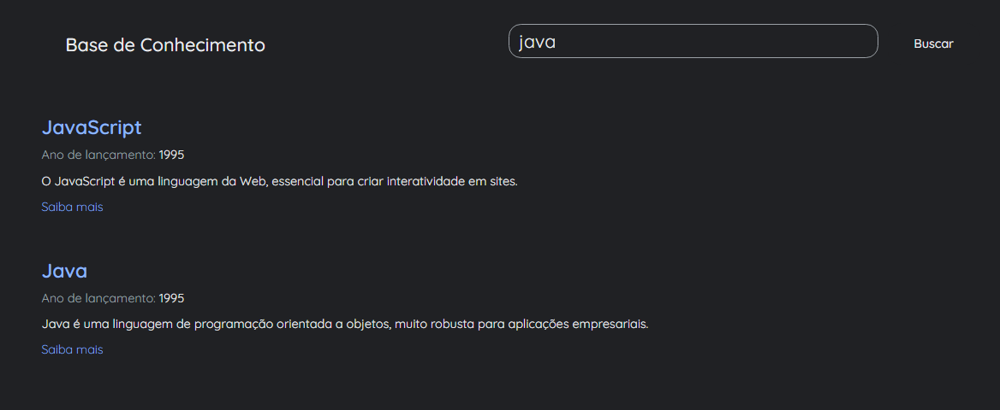

# 📚 Base de Conhecimento - Imersão Alura

> **Idioma / Language**
>
> [🇺🇸 English](./README.md) | 🇧🇷 **Português (Atual)**

---

Como estudante, estou sempre em busca de novas formas de crescer, e eu realmente amo cursos gratuitos e imersões disponíveis na web! Este projeto é uma Base de Conhecimento especial desenvolvida durante uma imersão gratuita de desenvolvimento web realizada pela [Alura](https://www.alura.com.br/).

Foi uma experiência incrível onde foquei em dominar conceitos modernos de desenvolvimento, tais como:
* **Async/Await**: Aprendendo a lidar com operações assíncronas.
* **Renderização**: Construindo a interface dinamicamente com base nos dados.
* **Funcionalidade de Busca**: Implementando um campo dedicado para filtrar e encontrar (ao clicar) suas linguagens favoritas em nossa base.
* **Gerenciamento de Dados**: Utilizando um arquivo `data.json` como banco de dados local para o projeto.
   
   
  

  

  <a href="https://nanncy-keller.github.io/knowledge-base-alura/" target="_blank">
    🚀 <strong>Clique aqui para testar o projeto Live!</strong>
  </a>

## ✨ A História

Todo projeto começa com uma faísca! Este projeto foi essencial para o meu crescimento. Ele me ensinou os fundamentos de:
* **Carregamento Dinâmico de Dados:** Buscando informações de um arquivo JSON usando `fetch()`.
* **Manipulação de DOM:** Criando cards dinamicamente com JavaScript para exibir detalhes das linguagens.
* **Lógica de Busca:** Filtrando resultados baseados na entrada do usuário, com foco nos nomes.

Essa experiência me deu a "luz" e a base técnica para construir o meu projeto **Erasure TrackSeeker**. É uma história clássica de como um pequeno passo inicial leva a uma nova ideia.

## 🛠️ Tecnologias Utilizadas

* **HTML5:** Estrutura básica para o catálogo de conhecimento.
* **CSS3:** Estilização com Variáveis CSS e Google Fonts como a *Quicksand*.
* **JavaScript:** Uso de `async/await` para busca de dados e lógica para o filtro de pesquisa.
* **JSON:** Banco de dados local (`data.json`) contendo informações de 17 linguagens de programação.

---
**© 2026 NANCY KELLER**
